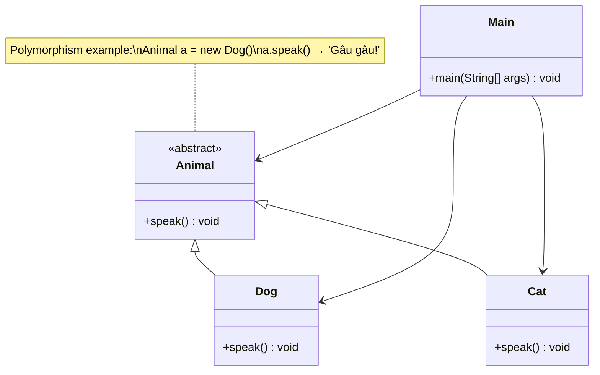
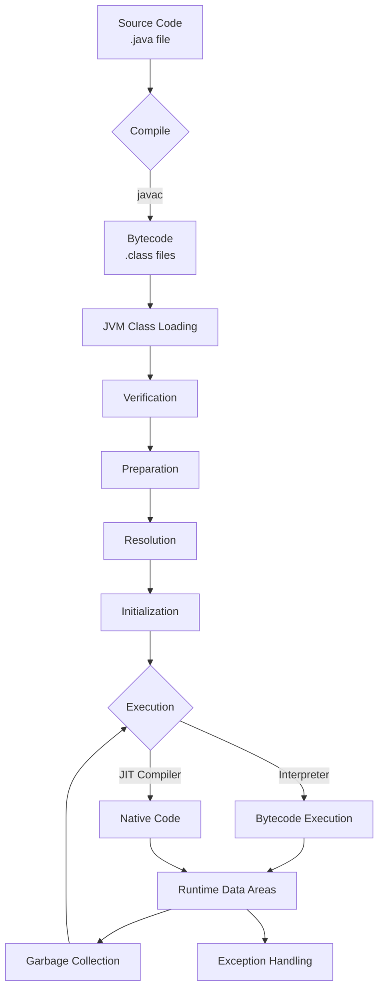
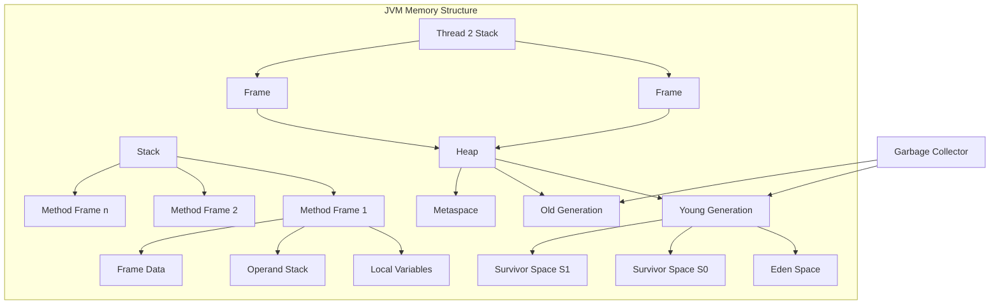
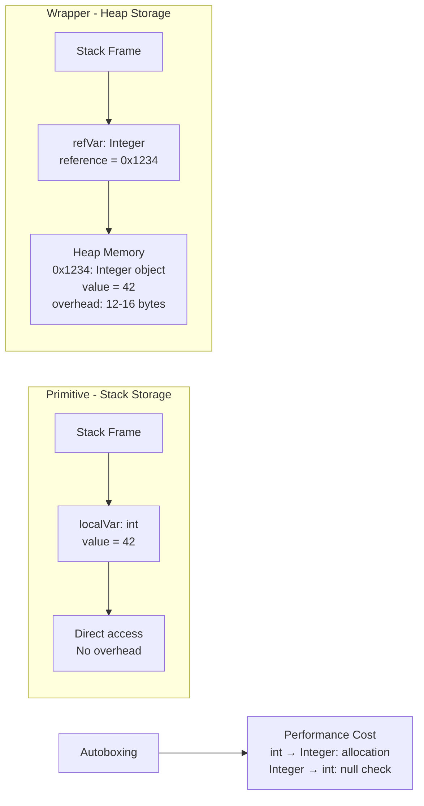
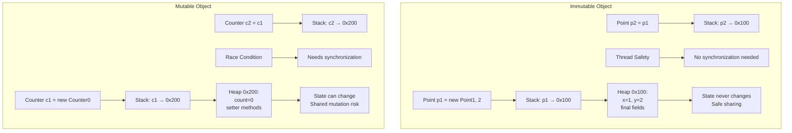
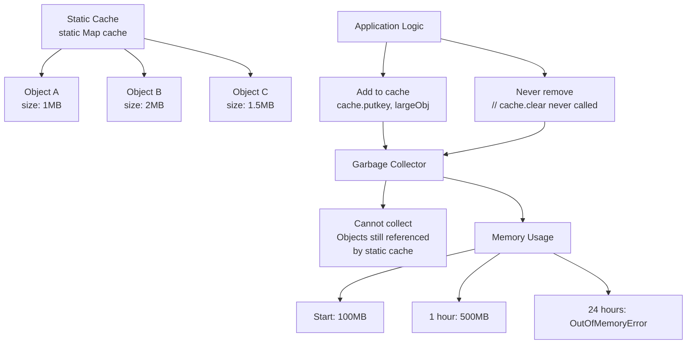

# Java cơ bản — Từ lớp đến JVM: hiểu để code không blind

---


**Slug:** `java-jvm-oop-co-ban`

**Meta description:** Giải mã OOP và JVM (JDK/JRE/JVM), hiểu stack vs heap, GC, primitive vs wrapper và immutable — nền tảng để bạn viết Java vững vàng, ít bị lỗi runtime.


Giải mã OOP + JVM (JDK/JRE/JVM) — nắm rõ lifecycle và memory model (stack vs heap, GC) để tránh lỗi runtime và rò rỉ logic. Hiểu nền tảng, code sẽ sạch và dễ duy trì.

---

## 1. Mở bài — chuyện tủ vs bàn 

Hồi xưa mình từng để quyển sách lên **bàn** rồi đi làm — mấy phút sau quay lại vẫn nguyên đó. Bàn là *heap*: chỗ chứa đồ lâu dài. Còn **tủ** thì như *stack*: mỗi ngăn chứa một thứ khi cần, đóng nắp là hết chuyện — method vào có, ra thì gọn. Khi code Java, nếu bạn nhầm lẫn giữa hai chỗ này, lúc debug bạn sẽ thấy mình như đang mò trong đêm: mất thời gian, căng thẳng, và đôi khi làm hỏng logic.

Mục tiêu bài này: dắt bạn đi từ class/object đến JVM, hiểu memory model để bạn không code kiểu "đại bàng bay qua" nữa — mà là kẻ gấp áo chuẩn, chậm mà chắc.

---

## 2. OOP cơ bản: Class / Object / Inheritance / Polymorphism

Java là ngôn ngữ hướng đối tượng. Bốn nguyên lý cơ bản: **Encapsulation, Inheritance, Polymorphism, Abstraction**. Không cần học phép thuật — cần tư duy tổ chức.

### Ví dụ ngắn (snippet 1)

```java
// src/main/java/com/example/oop/Animal.java
package com.example.oop;

class Animal {
    void speak() { System.out.println("Some sound..."); }
}

class Dog extends Animal {
    @Override
    void speak() { System.out.println("Gâu gâu!"); }
}

class Cat extends Animal {
    @Override
    void speak() { System.out.println("Meo meo!"); }
}

public class Main {
    public static void main(String[] args) {
        Animal a1 = new Dog();
        Animal a2 = new Cat();
        a1.speak(); // Gâu gâu!
        a2.speak(); // Meo meo!
    }
}
```

**Ghi nhớ:** `interface` và `abstract class` giúp tách giao diện và cài đặt. Polymorphism (upcasting) giúp code mở rộng dễ dàng.

### Diagram class relationships


---

## 3. JDK vs JRE vs JVM + lifecycle chương trình Java

* **JDK (Java Development Kit):** bộ công cụ để phát triển — có `javac`, `jar`, doc tool...
* **JRE (Java Runtime Environment):** môi trường chạy, bao gồm JVM + thư viện chuẩn.
* **JVM (Java Virtual Machine):** nơi thực thi bytecode, quản lý stack, heap, GC, JIT.

**Lifecycle đơn giản:**

1. `.java` → `javac` → `.class` (bytecode)
2. JVM load class → verify → execute bằng interpreter/JIT
3. JVM quản lý memory, GC thu dọn heap khi cần

** Mối quan hệ giữa JDK, JRE và JVM  **


### Diagram JVM lifecycle


---

## 4. Memory model: Stack vs Heap, Garbage Collector (GC)

* **Stack:** chứa frame cho mỗi method call; lưu các biến nguyên thủy (primitives) và references; tự động giải phóng khi method return.
* **Heap:** nơi lưu object; GC chịu trách nhiệm dọn object không còn reference.

**GC không phải là phép màu.** Rò rỉ memory trong Java thường do giữ reference vô tận (ví dụ `static List` lưu object cũ). Hiểu vòng đời object và cách GC hoạt động (generational: young/old) giúp bạn thiết kế và tối ưu.

**Tip thực chiến:** dùng `try-with-resources` cho tài nguyên IO; tránh giữ collection static chứa object lớn; cân nhắc `WeakHashMap` hoặc cơ chế eviction khi cần cache.

** Stack frame, heap generations: young, old **


** Cách GC hoạt động **


### Diagram Memory Model chi tiết


### Ví dụ memory leak thực tế
```java
public class MemoryLeakExample {
    private static final List<byte[]> LEAK_LIST = new ArrayList<>();
    
    public void processData(byte[] data) {
        // Quên không xóa khỏi list → memory leak
        LEAK_LIST.add(data);
        // Giải pháp: cần có cơ chế evict hoặc clear định kỳ
    }
}
```

### Ví dụ try-with-resources
```java
public class ResourceManagement {
    public void readFile(String path) {
        // Tự động đóng resource, tránh leak
        try (BufferedReader reader = new BufferedReader(new FileReader(path))) {
            String line;
            while ((line = reader.readLine()) != null) {
                System.out.println(line);
            }
        } catch (IOException e) {
            e.printStackTrace();
        }
    }
}
```

---

## 5. Primitive vs Wrapper, final vs Immutable — khi nào dùng gì

* **Primitive** (`int`, `long`, `boolean`) nhanh, không null — dùng cho counters, loops.
* **Wrapper** (`Integer`, `Long`) là object — có thể `null` và có chi phí autoboxing.

Ví dụ pitfall (snippet 2):

```java
Integer a = 1000;
Integer b = 1000;
System.out.println(a == b); // false (so sánh reference)

Integer x = 100;
Integer y = 100;
System.out.println(x == y); // true (cache -128..127)

Integer n = null;
int m = n; // NPE khi auto-unbox
```

### Diagram Primitive vs Wrapper Memory


### Performance benchmark thực tế
```java
public class PerformanceTest {
    public static void main(String[] args) {
        // Primitive version - nhanh hơn
        long start = System.nanoTime();
        int sum = 0;
        for (int i = 0; i < 1_000_000; i++) {
            sum += i;  // No boxing
        }
        long primitiveTime = System.nanoTime() - start;
        
        // Wrapper version - chậm hơn do autoboxing  
        Integer sumWrapper = 0;
        for (int i = 0; i < 1_000_000; i++) {
            sumWrapper += i;  // Autoboxing overhead
        }
        long wrapperTime = System.nanoTime() - start - primitiveTime;
        
        System.out.printf("Primitive: %d ns, Wrapper: %d ns%n", primitiveTime, wrapperTime);
    }
}
```

* **final**: khóa reference không thể gán lại, nhưng object vẫn mutable nếu class cho phép.
* **Immutable**: muốn class bất biến — dùng `private final` fields, không export setter, defensive copy arrays/collections.

Ví dụ immutable (snippet 3):

```java
public final class Point {
    private final int x;
    private final int y;
    public Point(int x, int y) { this.x = x; this.y = y; }
    public int getX() { return x; }
    public int getY() { return y; }
}
```

### Diagram Immutable vs Mutable


Immutable = an toàn hơn khi đa luồng và dễ reason.

---

## 6. Checklist trước khi push code (người truyền thống, làm đúng từng bước)

* [ ] Mỗi class đảm nhiệm 1 trách nhiệm (SRP)
* [ ] Tránh giữ static collection chứa object không dùng
* [ ] Dùng primitive cho counter/loop nếu cần performance
* [ ] Dùng `try-with-resources` cho IO
* [ ] Viết unit test cho edge cases (null, empty, overflow)
* [ ] Ưu tiên immutable objects khi liên quan concurrency
* [ ] Kiểm tra autoboxing/unboxing trong vòng lặp lớn
* [ ] Verify resource cleanup (file, socket, connection)

---

## FAQ ngắn

**Q1:** JVM có xử lý memory leak không?
**A1:** GC dọn object không còn tham chiếu; nhưng nếu reference còn tồn tại (ví dụ cache không evict) => leak vẫn xảy ra.



**Q2:** Dùng `int` hay `Integer` trong collection?
**A2:** Collection cần object → `Integer`. Nếu performance cần, dùng primitive-specialized collections (ví dụ `TIntArrayList` từ Trove) hoặc stream primitives.

**Q3:** `final` có làm object immutable không?
**A3:** Không. `final` khóa reference; object bên trong có thể thay đổi nếu design cho phép.

---

## Repo mẫu: `java-jumpstart` (structure & files ready-to-run)

```
java-jumpstart/
├─ README.md
├─ pom.xml
└─ src/
   └─ main/
      └─ java/
         └─ com/example/jumpstart/
            ├─ Main.java
            ├─ oop/Animal.java
            ├─ examples/
            │   ├─ AutoboxingPitfall.java
            │   ├─ MemoryLeakExample.java
            │   └─ PerformanceTest.java
            └─ immutables/
                ├─ Point.java
                └─ ResourceManagement.java
```

### pom.xml (Maven minimal)

```xml
<project xmlns="http://maven.apache.org/POM/4.0.0"
         xmlns:xsi="http://www.w3.org/2001/XMLSchema-instance"
         xsi:schemaLocation="http://maven.apache.org/POM/4.0.0 https://maven.apache.org/xsd/maven-4.0.0.xsd">
    <modelVersion>4.0.0</modelVersion>
    <groupId>com.example</groupId>
    <artifactId>java-jumpstart</artifactId>
    <version>1.0.0</version>
    <properties>
        <maven.compiler.source>17</maven.compiler.source>
        <maven.compiler.target>17</maven.compiler.target>
    </properties>
</project>
```

### README.md (cập nhật)

```
# java-jumpstart

Bài tập minh họa cho bài viết "Java cơ bản — Từ lớp đến JVM".

## Chạy
```bash
mvn compile exec:java -Dexec.mainClass="com.example.jumpstart.Main"
```

## Các ví dụ bao gồm:
- OOP với inheritance/polymorphism
- Autoboxing pitfalls và performance test
- Immutable objects
- Resource management với try-with-resources
- Memory leak examples

Các file demo ở `src/main/java/com/example/jumpstart`.


---

# Kết luận

Hiểu JVM và memory model không phải là "cao siêu" — mà là nền tảng để bạn viết code chất lượng hơn, ít bug hơn. Khi biết object sống ở đâu, GC hoạt động thế nào, bạn sẽ tự tin hơn trong việc thiết kế ứng dụng và xử lý vấn đề performance.

**Code không blind = hiểu từ bytecode đến runtime.** Chúc bạn code vui! 🚀

*📚 Bài tiếp theo: "Java Concurrency — Từ synchronized đến Thread Pool"*

---


<h2 class="f3 fw6 mb3">Care to comment</h2>
  <script src="https://utteranc.es/client.js"
        repo="Fast-9999/Fast-9999.github.io"
        issue-term="pathname"
        theme="preferred-color-scheme"
        crossorigin="anonymous"
        async>
</script>