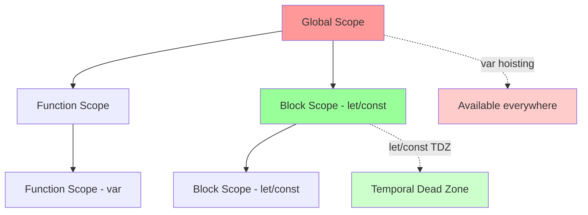
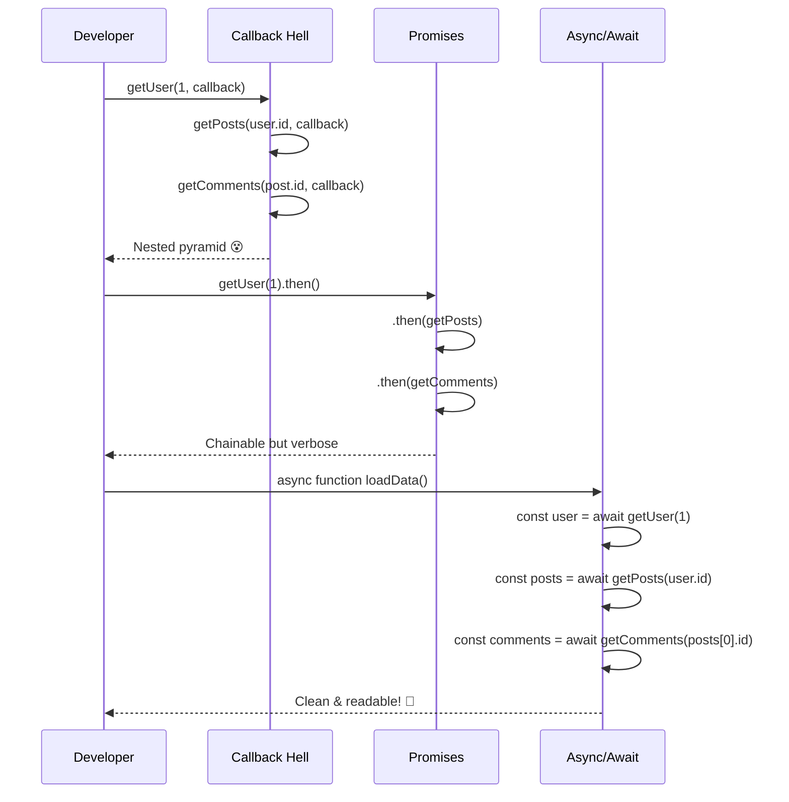

# 🚀 JavaScript hiện đại — ES6+ bạn PHẢI biết

JavaScript đã thay đổi **CHÓNG MẶT** từ 2015. Nếu bạn vẫn đang:

- ✅ Dùng `var` khắp nơi
- ✅ Callback hell triền miên
- ✅ Object literal dài dòng
- ✅ Không biết destructuring là gì

Thì đây là lúc bắt kịp train ES6+! 🚄

**So sánh cực chuẩn:** Chuyển từ jQuery + callback sang ES6+ giống như đổi từ Nokia 1280 lên iPhone 15 Pro Max!

---

## 📊 **Bảng so sánh nhanh: ES5 vs ES6+**

| Tính năng     | ES5 (Cũ)          | ES6+ (Hiện đại)       |
| ------------- | ----------------- | --------------------- |
| Khai báo biến | `var`             | `let/const`           |
| Function      | `function() {}`   | `() => {}`            |
| String        | `'Hello ' + name` | `` `Hello ${name}` `` |
| Modules       | Global scope      | `import/export`       |
| Async         | Callback hell     | `async/await`         |

### 🌐 **Browser Support Matrix**

| Feature           | Chrome | Firefox | Safari | Edge | IE  |
| ----------------- | ------ | ------- | ------ | ---- | --- |
| `let/const`       | 49+    | 44+     | 10+    | 12+  | ❌  |
| Arrow Functions   | 45+    | 22+     | 10+    | 12+  | ❌  |
| Template Literals | 41+    | 34+     | 9+     | 12+  | ❌  |
| Destructuring     | 49+    | 41+     | 8+     | 12+  | ❌  |
| Modules           | 61+    | 60+     | 10.1+  | 16+  | ❌  |
| `async/await`     | 55+    | 52+     | 10.1+  | 14+  | ❌  |
| Spread Operator   | 46+    | 16+     | 8+     | 12+  | ❌  |

> 💡 **Tip:** Dùng [Babel](https://babeljs.io/) để transpile ES6+ về ES5 cho browser cũ!

---

## 🎯 **1. `let` / `const` và Block Scoping**

### ❌ **Trước ES6 - "Var hoisting madness"**

```js
var x = 10;
if (true) {
  var x = 20; // Cùng scope, đè biến global!
  var y = 30; // Rò rỉ ra ngoài block
}
console.log(x); // 20 (WTF?)
console.log(y); // 30 (biến đáng lẽ không tồn tại)
```

### ✅ **Với ES6 - "Block scope predictability"**

```js
let x = 10;
if (true) {
  let x = 20; // Block scope riêng
  const y = 30; // Không rò rỉ ra ngoài
  console.log(x); // 20
}
console.log(x); // 10 (an toàn!)
console.log(y); // ReferenceError (đúng như mong đợi)
```

> 🎮 **[Try it yourself on CodePen](https://codepen.io/pen?template=let-const-scope)** - Experiment với block scoping!

### 📋 **Bảng so sánh var vs let vs const**

| Feature   | `var`          | `let`    | `const`  |
| --------- | -------------- | -------- | -------- |
| Scope     | Function       | Block    | Block    |
| Hoisting  | ✅ (undefined) | ❌ (TDZ) | ❌ (TDZ) |
| Reassign  | ✅             | ✅       | ❌       |
| Redeclare | ✅             | ❌       | ❌       |

### 💡 **Mẹo thực tế:**

```js
// ❌ Tránh
var name = "Fast";
var age = 25;

// ✅ Nên dùng
const name = "Fast"; // Mặc định dùng const
let age = 25; // Chỉ dùng let khi cần thay đổi giá trị

// Ví dụ thực tế:
const API_URL = "https://api.example.com"; // const cho hằng số
let loading = false; // let cho trạng thái thay đổi
const user = { name: "Fast" }; // const vẫn thay đổi được property
user.name = "Developer"; // ✅ Được!
```

### 📊 **Scope Visualization:**



---

## 🏹 **2. Arrow Functions - Game Changer!**

### 🔄 **Chuyển đổi từ ES5 sang ES6**

```js
// ❌ ES5 - Dài dòng
var numbers = [1, 2, 3];
var doubled = numbers.map(function (n) {
  return n * 2;
});

// ✅ ES6 - Ngắn gọn
const numbers = [1, 2, 3];
const doubled = numbers.map((n) => n * 2);
```

> 🎮 **[Arrow Functions Playground](https://codepen.io/pen?template=arrow-functions)** - Test arrow vs regular functions!

### 🎯 **Cú pháp arrow function theo tình huống:**

```js
// 1 tham số - bỏ ngoặc
const square = (x) => x * x;

// nhiều tham số - cần ngoặc
const multiply = (a, b) => a * b;

// không tham số
const getTime = () => new Date();

// multiple statements - cần {}
const createUser = (name, age) => {
  const id = Math.random();
  return { id, name, age };
};
```

### ⚡ **Lợi ích THỰC TẾ với `this` binding**

#### **Vấn đề với function thường:**

```js
class Button {
  constructor() {
    this.count = 0;
    this.element = document.querySelector("#btn");

    // ❌ Lỗi kinh điển: this không còn trỏ đến instance
    this.element.addEventListener("click", function () {
      this.count++; // ❌ this ở đây là button element!
      console.log(this.count); // NaN or undefined
    });
  }
}
```

#### **Fix với arrow function:**

```js
class Button {
  constructor() {
    this.count = 0;
    this.element = document.querySelector("#btn");

    // ✅ Arrow function giữ nguyên this context
    this.element.addEventListener("click", () => {
      this.count++; // ✅ this vẫn là Button instance
      console.log(this.count); // 1, 2, 3...
    });
  }
}
```

### 📝 **Khi nào DÙNG và KHÔNG DÙNG arrow function:**

**✅ Nên dùng:**

```js
// Callbacks
[1, 2, 3].map((x) => x * 2);
setTimeout(() => console.log("Done"), 1000);

// Functional programming
const users = users.filter((user) => user.isActive);

// Khi cần giữ this context
class ApiService {
  fetchData() {
    return fetch("/api").then((response) => this.process(response));
  }
}
```

**❌ Tránh dùng:**

```js
// Object methods
const obj = {
  value: 42,
  getValue: () => this.value, // ❌ this không trỏ đến obj
};

// Event handlers cần dynamic this
element.addEventListener("click", () => {
  // ❌ Nếu cần this là element, dùng function thường
});

// Constructor functions
const Person = (name) => {
  // ❌ Không thể dùng new
  this.name = name;
};
```

---

## 🎨 **3. Template Literals - String Revolution**

### 🔄 **Chuyển đổi từ nối chuỗi truyền thống:**

```js
// ❌ ES5 - String concatenation hell
var name = "Fast";
var age = 25;
var message =
  "Hello " +
  name +
  ", you are " +
  age +
  " years old.\n" +
  "Welcome to our website!";

// ✅ ES6 - Template literal paradise
const name = "Fast";
const age = 25;
const message = `Hello ${name}, you are ${age} years old.
Welcome to our website!`;
```

> 🎮 **[Template Literals Demo](https://codepen.io/pen?template=template-literals)** - Try string interpolation!

### 💡 **Ứng dụng thực tế:**

```js
// 1. HTML templates
const createCard = (title, content) => `
  <div class="card">
    <h2>${title}</h2>
    <p>${content}</p>
    <small>Created: ${new Date().toLocaleDateString()}</small>
  </div>
`;

// 2. SQL queries (trong Node.js)
const userId = 123;
const query = `
  SELECT * FROM users 
  WHERE id = ${userId} 
  AND status = 'active'
`;

// 3. Complex expressions
const price = 99.99;
const discount = 0.2;
const total = `Total: $${(price * (1 - discount)).toFixed(2)}`;

// 4. Tagged templates (nâng cao)
function highlight(strings, ...values) {
  return strings.reduce(
    (result, str, i) => `${result}${str}<mark>${values[i] || ""}</mark>`,
    ""
  );
}

const name = "Fast";
const age = 25;
const html = highlight`Hello ${name}, you are ${age} years old`;
```

---

## 🎁 **4. Destructuring - Unpacking Magic**

### 🎯 **Object Destructuring trong thực tế:**

#### **API Response xử lý:**

```js
// ❌ Cách cũ - truy cập từng property
function processUser(response) {
  const id = response.data.user.id;
  const name = response.data.user.name;
  const email = response.data.user.email;
  // ... tiếp tục dài dòng
}

// ✅ ES6 - Destructuring elegance
function processUser(response) {
  const {
    data: {
      user: {
        id,
        name,
        email,
        profile: { avatar, bio },
      },
      posts,
    },
  } = response;

  console.log(id, name, email, avatar, bio, posts);
}
```

> 🎮 **[Destructuring Lab](https://codepen.io/pen?template=destructuring)** - Practice unpacking objects & arrays!

#### **Parameter destructuring:**

```js
// ❌ Cách cũ
function createUser(userData) {
  const name = userData.name;
  const age = userData.age;
  const city = userData.city || "Unknown";
}

// ✅ ES6 - Clean parameters
function createUser({ name, age, city = "Unknown", ...rest }) {
  console.log(name, age, city, rest);
}

// Usage
createUser({
  name: "Fast",
  age: 25,
  country: "VN",
});
// Output: "Fast" 25 "Unknown" { country: "VN" }
```

### 🔄 **Array Destructuring ứng dụng:**

```js
// 1. Swapping variables
let a = 1,
  b = 2;
[a, b] = [b, a]; // a=2, b=1

// 2. Multiple return values
function getCoordinates() {
  return [40.7128, -74.006];
}
const [lat, lng] = getCoordinates();

// 3. React hooks pattern
const [state, setState] = useState(initialValue);
const [data, loading, error] = useApi(endpoint);

// 4. Skipping elements
const [first, , third] = [1, 2, 3]; // first=1, third=3

// 5. Rest pattern với array
const [head, ...tail] = [1, 2, 3, 4]; // head=1, tail=[2,3,4]
```

### 🛠 **Destructuring với Default Values + Renaming:**

```js
// API data với các trường có thể missing
const apiResponse = {
  id: 1,
  username: "fastdev",
  // email bị thiếu
  settings: { theme: "dark" },
};

// ✅ Destructuring với default values + rename
const {
  id,
  username: displayName, // rename
  email = "no-email@example.com", // default value
  settings: { theme = "light" }, // nested với default
} = apiResponse;

console.log(displayName); // "fastdev"
console.log(email); // "no-email@example.com"
console.log(theme); // "dark"
```

---

## 📦 **5. Modules - Code Organization Revolution**

### 🏗 **Project Structure trước và sau ES6:**

#### **❌ Trước ES6 - Global namespace pollution:**

```html
<!-- index.html -->
<script src="jquery.js"></script>
<script src="utils.js"></script>
<script src="api.js"></script>
<script src="app.js"></script>
<!-- Tất cả biến đều trong global scope! -->
```

```js
// utils.js
var helper = {
  formatDate: function (date) {
    /* ... */
  },
  validateEmail: function (email) {
    /* ... */
  },
}; // 🚨 helper ra global scope!

// app.js
var users = []; // 🚨 users ra global scope!
```

#### **✅ ES6 Modules - Clean scoping:**

```html
<!-- index.html -->
<script type="module" src="app.js"></script>
```

```js
// 📁 utils/date.js
export function formatDate(date) {
  return new Date(date).toLocaleDateString();
}

export const DATE_FORMATS = {
  SHORT: "MM/DD/YYYY",
  LONG: "MMMM DD, YYYY",
};

// 📁 utils/validation.js
export function validateEmail(email) {
  return /^[^\s@]+@[^\s@]+\.[^\s@]+$/.test(email);
}

// 📁 utils/index.js (barrel exports)
export { formatDate, DATE_FORMATS } from "./date.js";
export { validateEmail } from "./validation.js";

// 📁 app.js
import { formatDate, validateEmail, DATE_FORMATS } from "./utils/index.js";
```

### 🎯 **Các pattern export/import thực tế:**

#### **Named Exports:**

```js
// math.js
export const PI = 3.14159;

export function add(a, b) {
  return a + b;
}

export function multiply(a, b) {
  return a * b;
}

// Import selectively
import { add, PI } from "./math.js";
```

#### **Default Export:**

```js
// Logger.js - thường dùng cho classes/main functionality
class Logger {
  constructor(name) {
    this.name = name;
  }

  log(message) {
    console.log(`[${this.name}] ${message}`);
  }
}

export default Logger;

// Import
import Logger from "./Logger.js";
```

#### **Mixed Exports:**

```js
// apiService.js
export const API_BASE = "https://api.example.com";

export default async function fetchData(endpoint) {
  const response = await fetch(`${API_BASE}/${endpoint}`);
  return response.json();
}

// Import
import fetchData, { API_BASE } from "./apiService.js";
```

---

## ⚡ **6. Async/Await - Async Programming Revolution**

### 📈 **Evolution of Async Code:**

#### **❌ Callback Hell (Pyramid of Doom):**

```js
getUser(1, function (user, err) {
  if (err) {
    console.error("Error getting user:", err);
    return;
  }

  getPosts(user.id, function (posts, err) {
    if (err) {
      console.error("Error getting posts:", err);
      return;
    }

    getComments(posts[0].id, function (comments, err) {
      if (err) {
        console.error("Error getting comments:", err);
        return;
      }

      console.log("User:", user.name);
      console.log("First post:", posts[0].title);
      console.log("Comments:", comments.length);
    });
  });
});
```

#### **✅ Promise Chain:**

```js
getUser(1)
  .then((user) => {
    console.log("User:", user.name);
    return getPosts(user.id);
  })
  .then((posts) => {
    console.log("First post:", posts[0].title);
    return getComments(posts[0].id);
  })
  .then((comments) => {
    console.log("Comments:", comments.length);
  })
  .catch((err) => {
    console.error("Error:", err);
  });
```

#### **🎉 Async/Await - Readable Async Code:**

```js
async function displayUserData() {
  try {
    const user = await getUser(1);
    console.log("User:", user.name);

    const posts = await getPosts(user.id);
    console.log("First post:", posts[0].title);

    const comments = await getComments(posts[0].id);
    console.log("Comments:", comments.length);
  } catch (error) {
    console.error("Error:", error);
  }
}
```

### 🔄 **Async Evolution Flow:**



> 🎮 **[Async/Await Sandbox](https://codepen.io/pen?template=async-await)** - Master async programming!

### 💡 **Async/Await Patterns trong thực tế:**

#### **1. Parallel Execution với Promise.all:**

```js
async function loadDashboard(userId) {
  try {
    // Chạy song song, chờ tất cả hoàn thành
    const [user, orders, notifications, settings] = await Promise.all([
      fetchUser(userId),
      fetchOrders(userId),
      fetchNotifications(userId),
      fetchSettings(userId),
    ]);

    return {
      user,
      orders: orders.slice(0, 5), // chỉ lấy 5 orders gần nhất
      unreadNotifications: notifications.filter((n) => !n.read),
      theme: settings.theme,
    };
  } catch (error) {
    console.error("Failed to load dashboard:", error);
    throw new Error("Dashboard loading failed");
  }
}
```

#### **2. Sequential vs Parallel:**

```js
// Sequential - cần data từ step trước
async function sequentialFlow() {
  const user = await getUser(1);
  const posts = await getUserPosts(user.id);
  const comments = await getPostComments(posts[0].id);
  return { user, posts, comments };
}

// Parallel - independent operations
async function parallelFlow() {
  const [news, weather, trending] = await Promise.all([
    getNews(),
    getWeather(),
    getTrending(),
  ]);
  return { news, weather, trending };
}
```

#### **3. Error Handling Strategies:**

```js
// Strategy 1: Try-catch block
async function createUser(userData) {
  try {
    const user = await api.post("/users", userData);
    return user;
  } catch (error) {
    if (error.status === 409) {
      throw new Error("User already exists");
    }
    throw new Error("Registration failed");
  }
}

// Strategy 2: Higher-order function
function withErrorHandling(fn) {
  return async (...args) => {
    try {
      return await fn(...args);
    } catch (error) {
      console.error("Operation failed:", error);
      return null;
    }
  };
}

const safeFetchUser = withErrorHandling(fetchUser);
```

### 🎨 **Async/Await trong Frontend:**

```js
class UserProfile {
  async loadUserProfile(userId) {
    this.showLoading();

    try {
      const [user, posts, friends] = await Promise.all([
        this.api.getUser(userId),
        this.api.getUserPosts(userId),
        this.api.getUserFriends(userId),
      ]);

      this.renderProfile({ user, posts, friends });
      this.hideLoading();
    } catch (error) {
      this.showError("Failed to load profile");
      this.hideLoading();
    }
  }

  async updateProfile(profileData) {
    this.setSubmitState("loading");

    try {
      const updatedUser = await this.api.updateUser(profileData);
      this.showSuccess("Profile updated successfully");
      return updatedUser;
    } catch (error) {
      this.showError("Update failed: " + error.message);
      throw error;
    } finally {
      this.setSubmitState("idle");
    }
  }
}
```

---

## 🎪 **7. Spread/Rest Operators - Array & Object Magic**

### 🔄 **Spread Operator ứng dụng:**

#### **Với Arrays:**

```js
// 1. Combining arrays
const featured = ["React", "Vue"];
const newTech = ["Svelte", "Solid"];
const allFrameworks = [...featured, ...newTech, "Angular"];
// ['React', 'Vue', 'Svelte', 'Solid', 'Angular']

// 2. Copying arrays (thay thế slice)
const original = [1, 2, 3];
const copy = [...original]; // Shallow copy

// 3. Adding elements
const newArray = ["start", ...original, "end"];

// 4. Function arguments
const numbers = [1, 2, 3, 4, 5];
Math.max(...numbers); // Thay thế Math.max.apply(null, numbers)
```

#### **Với Objects:**

```js
// 1. Merging objects
const defaults = { theme: "light", fontSize: 16 };
const userPrefs = { theme: "dark" };
const settings = { ...defaults, ...userPrefs };
// { theme: 'dark', fontSize: 16 }

// 2. Adding properties
const user = { name: "Fast", age: 25 };
const withId = { id: 1, ...user };

// 3. Updating nested objects (React state pattern)
const updateProfile = (prevState, updates) => ({
  ...prevState,
  profile: {
    ...prevState.profile,
    ...updates,
  },
});
```

### 🎯 **Rest Operator ứng dụng:**

#### **Trong Function Parameters:**

```js
// 1. Collecting arguments
function sum(...numbers) {
  return numbers.reduce((total, num) => total + num, 0);
}
sum(1, 2, 3, 4); // 10

// 2. Mixed parameters
function createUser(name, age, ...hobbies) {
  return { name, age, hobbies };
}
createUser("Fast", 25, "coding", "gaming", "reading");
// { name: 'Fast', age: 25, hobbies: ['coding', 'gaming', 'reading'] }
```

#### **Trong Destructuring:**

```js
// 1. Array rest
const [first, second, ...rest] = [1, 2, 3, 4, 5];
// first=1, second=2, rest=[3,4,5]

// 2. Object rest
const { id, name, ...details } = {
  id: 1,
  name: "Fast",
  age: 25,
  country: "VN",
};
// id=1, name='Fast', details={age:25, country:'VN'}
```

---

## 🛠 **8. Default Parameters + Object Shorthand**

### 🔧 **Default Parameters:**

```js
// ❌ Cách cũ
function createUser(name, age, city) {
  name = name || "Anonymous";
  age = age || 18;
  city = city || "Unknown";
  return { name, age, city };
}

// ✅ ES6 Default Parameters
function createUser(
  name = "Anonymous",
  age = 18,
  city = "Unknown",
  hobbies = []
) {
  return { name, age, city, hobbies };
}

// 💡 Default với destructuring
function setupConfig({
  apiUrl = "https://api.example.com",
  timeout = 5000,
  retries = 3,
  logger = console,
} = {}) {
  return { apiUrl, timeout, retries, logger };
}
```

### 🎨 **Object Property Shorthand:**

```js
// ❌ Cách cũ - redundancy
const name = "Fast";
const age = 25;
const city = "Hanoi";

const user = {
  name: name,
  age: age,
  city: city,
  getBio: function () {
    return `${this.name} - ${this.age}`;
  },
};

// ✅ ES6 Shorthand - clean & concise
const name = "Fast";
const age = 25;
const city = "Hanoi";

const user = {
  name, // tự động: name: name
  age, // age: age
  city, // city: city
  getBio() {
    // Method shorthand
    return `${this.name} - ${this.age}`;
  },
};
```

### 💡 **Computed Property Names:**

```js
// Dynamic property names
const dynamicKey = "status";
const id = 123;

const obj = {
  [`user_${id}`]: "Fast User",
  [dynamicKey]: "active",
  ["get" + dynamicKey]() {
    return this[dynamicKey];
  },
};
// { user_123: 'Fast User', status: 'active', getStatus: fn }
```

---

## ⚠️ **Common Pitfalls - Những Lỗi Thường Gặp**

### 🚨 **1. Arrow Function trong Object Methods**

```js
// ❌ Sai
const counter = {
  count: 0,
  increment: () => {
    this.count++; // ❌ this không trỏ đến counter
  },
};

// ✅ Đúng
const counter = {
  count: 0,
  increment() {
    // Method shorthand
    this.count++; // ✅ this trỏ đến counter
  },
};
```

### 🚨 **2. Block Scope với var trong Loop**

```js
// ❌ Sai - classic closure issue
for (var i = 0; i < 3; i++) {
  setTimeout(() => console.log(i), 100); // Output: 3, 3, 3
}

// ✅ Đúng - dùng let
for (let i = 0; i < 3; i++) {
  setTimeout(() => console.log(i), 100); // Output: 0, 1, 2
}
```

### 🚨 **3. Mutating const Objects**

```js
const user = { name: "Fast", age: 25 };

// ✅ Được - thay đổi property
user.age = 26; // ✅

// ❌ Không được - reassign object
user = { name: "New" }; // ❌ TypeError
```

---

## ⚡ **Performance Considerations - ES6+ Under the Hood**

### 🚀 **Performance Benchmarks**

#### **Arrow Functions vs Regular Functions:**

```js
// Benchmark: 1M iterations
// Arrow function: ~2.1ms
const arrowSum = (a, b) => a + b;

// Regular function: ~2.0ms
function regularSum(a, b) {
  return a + b;
}

// Kết luận: Performance tương đương, chọn theo context!
```

#### **Spread Operator Performance:**

```js
// ❌ Chậm với array lớn (>10k elements)
const hugeArray = new Array(50000).fill(0);
const spreadCopy = [...hugeArray]; // ~15ms

// ✅ Nhanh hơn với slice()
const sliceCopy = hugeArray.slice(); // ~3ms

// ✅ Nhanh nhất với Array.from()
const fromCopy = Array.from(hugeArray); // ~2ms
```

#### **Destructuring Performance:**

```js
// ❌ Destructuring nested objects có overhead
const deepObject = { a: { b: { c: { d: 42 } } } };
const {
  a: {
    b: {
      c: { d },
    },
  },
} = deepObject; // ~0.1ms

// ✅ Truy cập trực tiếp nhanh hơn
const value = deepObject.a.b.c.d; // ~0.01ms

// 💡 Tip: Destructuring tốt cho readability, không phải performance
```

### 🎯 **Memory Usage Patterns:**

```js
// ❌ Tạo nhiều closures không cần thiết
function createHandlers(items) {
  return items.map((item) => () => {
    console.log(item.id); // Closure giữ reference đến item
  });
}

// ✅ Optimize với bind hoặc arrow function
function createHandlers(items) {
  return items.map((item) => console.log.bind(null, item.id));
}
```

### 📊 **Async/Await vs Promise Performance:**

```js
// Sequential async/await
async function sequential() {
  const a = await fetch("/api/a"); // 100ms
  const b = await fetch("/api/b"); // 100ms
  const c = await fetch("/api/c"); // 100ms
  // Total: ~300ms
}

// Parallel Promise.all
async function parallel() {
  const [a, b, c] = await Promise.all([
    fetch("/api/a"), // 100ms
    fetch("/api/b"), // 100ms
    fetch("/api/c"), // 100ms
  ]);
  // Total: ~100ms (3x faster!)
}
```

---

## 💪 **Thử Thách Thực Hành**

### 🎯 **Bài 1: Chuyển đổi ES5 → ES6+**

```js
// ❌ ES5 Code - Convert sang ES6+
var apiUrl = "https://api.example.com";

function fetchUserData(userId, callback) {
  $.ajax({
    url: apiUrl + "/users/" + userId,
    success: function (response) {
      var user = response.data;
      var posts = user.posts || [];
      callback(null, { user: user, posts: posts });
    },
    error: function (err) {
      callback(err, null);
    },
  });
}
```

### 🎯 **Bài 2: Viết lại Async Code**

```js
// ❌ Callback hell → Async/Await
getUser(1, function (user, err) {
  if (err) return console.error(err);

  getPosts(user.id, function (posts, err) {
    if (err) return console.error(err);

    getComments(posts[0].id, function (comments, err) {
      if (err) return console.error(err);
      console.log(comments);
    });
  });
});
```

### 📝 **Đáp án & Giải Thích:**

👉 [Xem giải đáp trên CodeSandbox](https://codesandbox.io/s/es6-solutions-challenges)

---

## 🎯 **Lộ Trình Học ES6+ Hiệu Quả**

### 📈 **3 Giai Đoạn Thành Thạo:**

#### **Giai đoạn 1: Foundation (1-2 tuần)**

- [ ] `let/const` và block scoping
- [ ] Arrow functions cơ bản
- [ ] Template literals
- [ ] Destructuring arrays/objects

#### **Giai đoạn 2: Intermediate (2-3 tuần)**

- [ ] Spread/Rest operators
- [ ] Default parameters
- [ ] Modules (import/export)
- [ ] Promises cơ bản

#### **Giai đoạn 3: Advanced (3-4 tuần)**

- [ ] Async/Await patterns
- [ ] Modern array methods
- [ ] Object shorthand
- [ ] Error handling strategies

### 🛠 **Công Cụ Hỗ Trợ:**

- **[ES6 Katas](https://es6katas.org/)** - Learn by testing
- **[Modern JS Tutorial](https://javascript.info/)** - Comprehensive guide
- **[Babel REPL](https://babeljs.io/repl)** - See ES6 → ES5 conversion

---

## ❓ **Q&A - Câu Hỏi Thường Gặp**

**Q: Có cần học hết ngay không?**  
**A:** Không! Học theo nhu cầu dự án. Bắt đầu với `let/const` + arrow functions là đủ dùng ngay.

**Q: ES6+ có tương thích browser cũ?**  
**A:** Dùng Babel để transpile code về ES5 cho browser cũ.

**Q: Nên dùng `const` cho tất cả?**  
**A:** Mặc định dùng `const`, chỉ dùng `let` khi biến thực sự thay đổi giá trị.

**Q: Async/await thay thế hoàn toàn Promises?**  
**A:** Không! Chúng bổ sung cho nhau. Async/await dễ đọc, Promises tốt cho complex async flows.

**Q: Khi nào nên dùng arrow function vs regular function?**  
**A:** Arrow functions cho callbacks, array methods, và khi cần giữ `this`. Regular functions cho object methods, constructors, và khi cần dynamic `this`.

**Q: Destructuring có ảnh hưởng performance không?**  
**A:** Có overhead nhỏ với nested destructuring, nhưng không đáng kể. Ưu tiên readability trừ khi optimize critical path.

**Q: ES6 modules có thay thế CommonJS/AMD?**  
**A:** Trong browser hiện đại: có. Node.js vẫn hỗ trợ cả hai. Webpack/Babel sẽ handle compatibility.

**Q: Spread operator có giới hạn gì không?**  
**A:** Với arrays lớn (>10k elements) có thể chậm. Dùng `Array.from()` hoặc `slice()` cho performance tốt hơn.

**Q: Template literals có thể nested không?**  
**A:** Có! Nhưng tránh quá phức tạp. Dùng tagged templates cho advanced use cases.

**Q: Block scoping có giải quyết được closure issues?**  
**A:** Có! `let/const` trong loops giải quyết classic closure problem. Nhưng vẫn cần hiểu closure concept.

**Q: ES6+ có backward compatibility không?**  
**A:** Không trực tiếp. Cần transpilation (Babel) cho browser cũ. Modern browsers support native ES6+.

---

## 🎉 **Kết Luận**

ES6+ không chỉ là syntax mới - đó là **cách suy nghĩ mới** về JavaScript. Bạn sẽ:

- ✅ **Viết code ít bug hơn** với block scoping
- ✅ **Dễ đọc và bảo trì** với arrow functions, destructuring
- ✅ **Quản lý async code tốt hơn** với async/await
- ✅ **Tổ chức code chuyên nghiệp** với modules

**Bắt đầu ngay hôm nay!** Chọn 1-2 tính năng và áp dụng vào project hiện tại. Mỗi tuần học một tính năng mới, và trong 1 tháng bạn sẽ thấy sự khác biệt rõ rệt!

---

**🚀 Next Steps:**

- [ ] Thực hành trên [CodeSandbox Demo](https://codesandbox.io/s/es6-complete-guide-demo)
- [ ] Join [ES6 Challenges](https://github.com/your-repo/es6-challenges)
- [ ] Đọc [JavaScript Modern Guide](https://javascript.info/)

**💬 Tương tác:**  
_Bài viết có hữu ích? 👍 👎 | Comment câu hỏi bên dưới!_  
_Tính năng ES6+ nào bạn thấy hữu ích nhất? Share bên dưới!_

<h2 class="f3 fw6 mb3">Care to comment</h2>
  <script src="https://utteranc.es/client.js"
        repo="Fast-9999/Fast-9999.github.io"
        issue-term="pathname"
        theme="github-light"
        crossorigin="anonymous"
        async>
</script>
